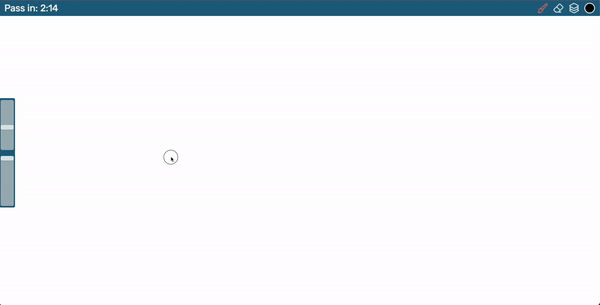
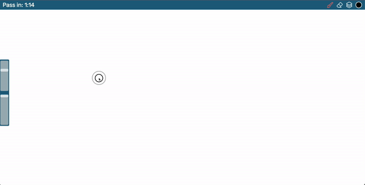
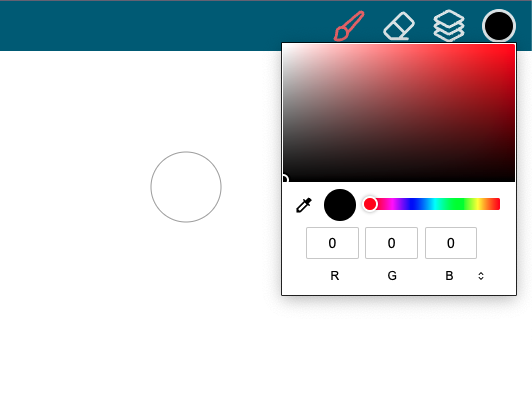
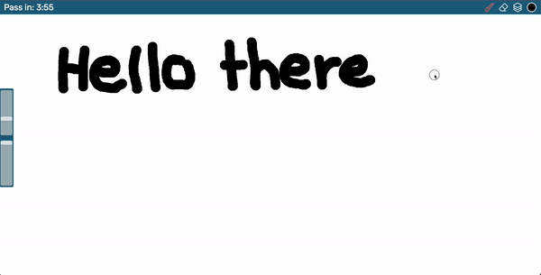
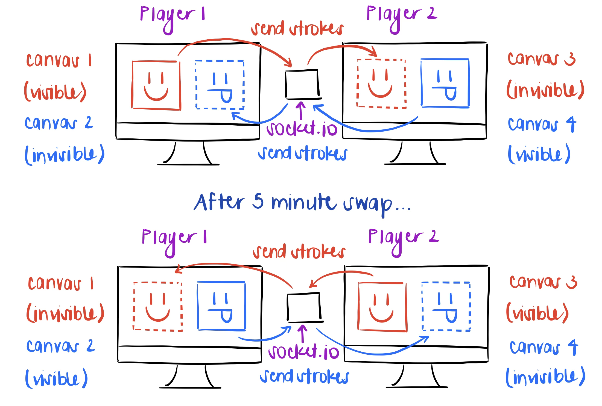
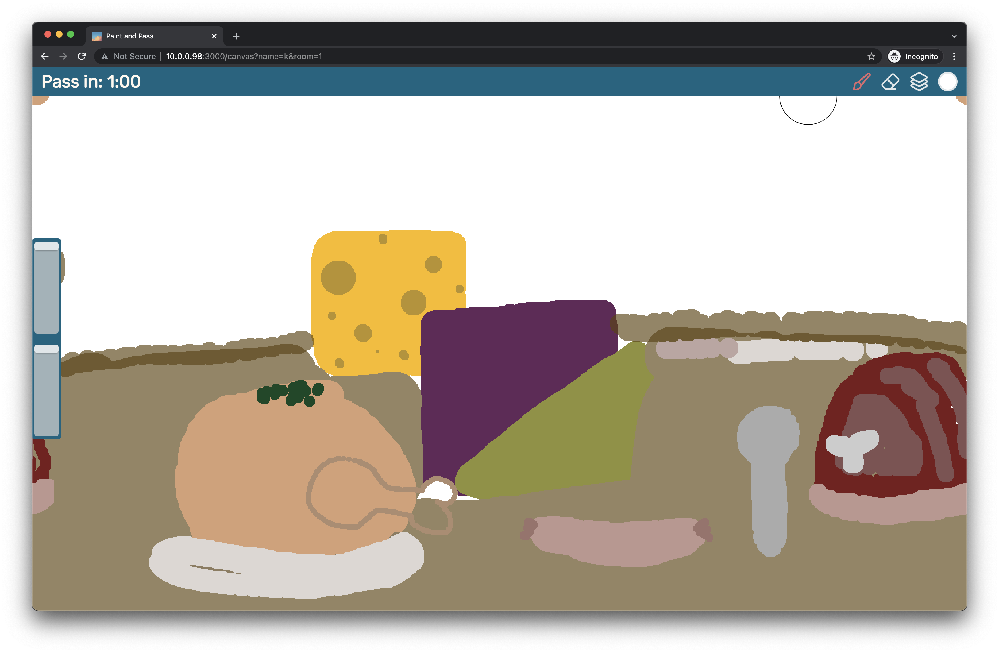
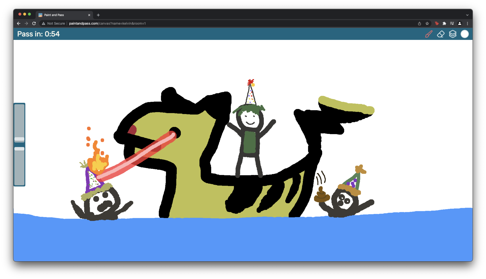

# Paint and Pass
Paint and Pass is a painting app where you swap canvases every 5 minutes

[Live link](www.paintandpass.com)

They always say two brains are better than one. Paint and Pass was inspired by an activity where artists trade paintings every five minutes and continue where the other left off. Now it is brought to you in digital format ready to be played at the convenience of your computer.

# Table of Contents
- [Key Features](#key-features)
- [Process and How It Works](#process-and-how-it-works)
- [What I Learned](#what-i-learned)
- [Credits](#credits)
- [First Successful Paint and Pass](#first-successful-paint-and-pass)

# Key Features
- Brush Scaling  

- Brush Opacity  

- Color Selector  

- Layers  

# Process and How It Works
The canvas page's design was based off of the iPad app Procreate. I frequently 
use Procreate (in fact the landing page's art was created with Procreate!) and 
thought the design was minimal and clean. Once the design of the page was set 
up the majority of the time was spent setting up all the functionality of the 
painting app itself and the connection feature. 

Each room with two players utilizes 2 sockets. Using p5.js's instance mode, I 
created two canvases for each player. Player 1 will have canvas 1 and 2 while 
player 2 will have canvas 3 and 4. On the server, canvas 1 and 3 communicate and 
canvas 2 and 4 communicate. When a client connects to the server, the server 
will determine if they are player 1 or 2. Player 1 will have canvas 1 visible 
and canvas 2 invisible. Player 2 will have canvas 4 visible and canvas 3 
invisible. Recall that canvas 1-3 and 2-4 communicate. When painting each 
player's stroke data are sent to the other player. When a client receives paint 
stroke data it will place that data on the invisible canvas. After five minutes 
are up a "swap" happens where the each player's two canvases will swap 
visibility.

Paint and Pass was implemented this way with two sockets because I wanted each 
player to be able to control the swapped painting in the exact same way that 
the other player could - modifying the painting layer by layer, deleting a 
layer, etc). Having two instances of a canvas allowed for this behavior for a 
trade off of more strain on the server keeping track of four canvases for each 
room and the client using two sockets for the canvas page.

# What I Learned
This was the first project that I had created a server with Express to host the 
website. I learned about endpoints and how a client can make GET, PUT, POST, 
and DELETE to communicate with the server. On top of that it was also my first 
time using Socket.IO to be able to communicate the paint strokes in real time. 
When writing the client and server code for Socket.IO I found out the 
importance of ACK's and OK's that is important for protocols like TCP. I ran 
into an issue where messages from the client was not making it the server 
occasionally which caused inconsistent bugs. This was fixed by having the 
client and server re-sending their messages every few seconds until they 
recieved an OK.

# Credits
## Built With
- [Node.js](https://nodejs.org/en/)
- [Express](https://expressjs.com)
- [p5.js](https://p5js.org)
- [Socket.IO](https://socket.io)

## Resources
- [True Erase p5.js](https://codepen.io/DanielHarty/pen/jzGVWV) Thank you ❤️
- [Global and instance mode](https://github.com/processing/p5.js/wiki/Global-and-instance-mode)
## Icons for Buttons
Thank you for your beautiful icons
- [Melvin ilham Oktaviansyah](https://freeicons.io/profile/8939)
- [Gayrat Muminov](https://freeicons.io/profile/3277)
- [Anu Rocks](https://freeicons.io/profile/730)

# First Successful Paint and Pass

